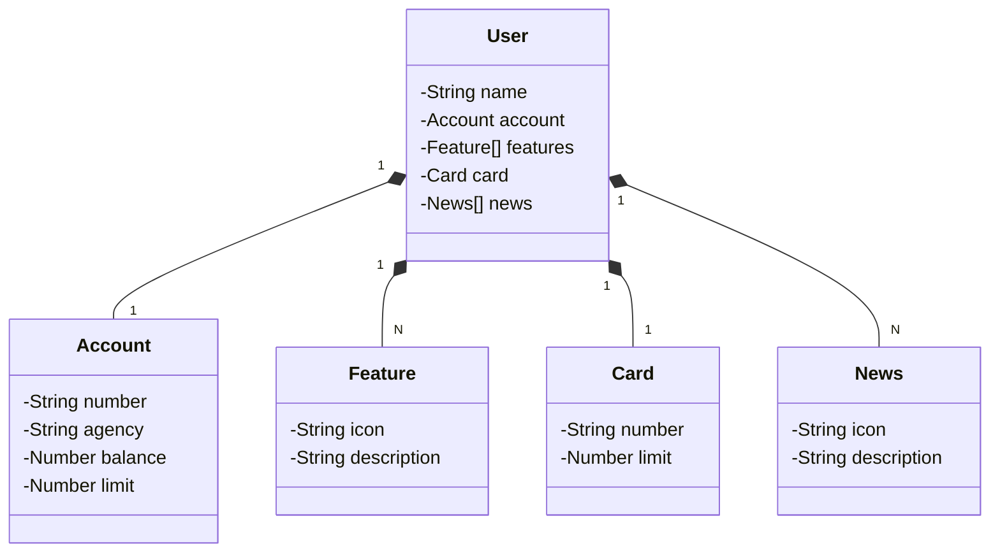

# Abstração de Domínio Bancário

O objetivo deste projeto é abstrair a camada de domínio de um sistema bancário.
As entidades incluem Usuário, Conta, Funcionalidades, Cartão e Notícias.

## Tecnologias Utilizadas

- **Java 17**
- **Spring Boot 3** 
- **Spring Data JPA**
- **PostgreSQL**
- **Railway**
- **Open API (Swagger)**

## Documentação

**Link**: https://restful-bank-api-production.up.railway.app/swagger-ui/index.html#/

## Diagrama de Classes

O diagrama de classes a seguir ilustra a estrutura do domínio do sistema:

